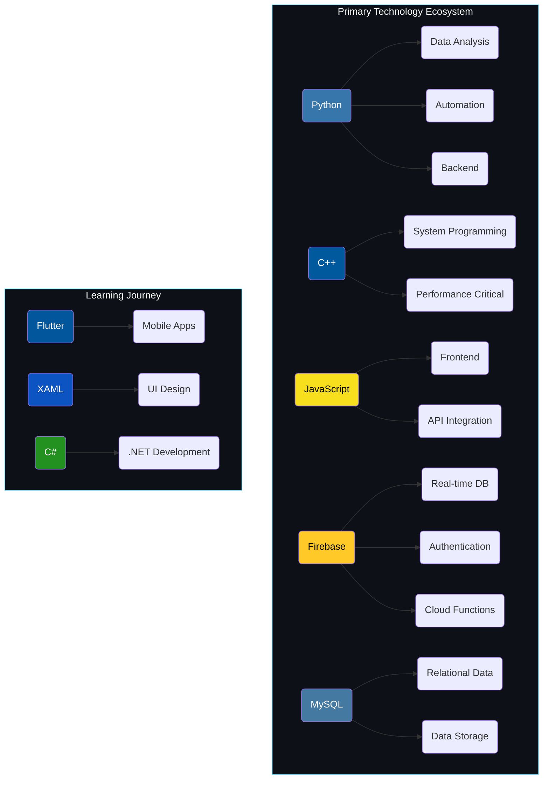

<div align="center">
  
# `{ Dev_Alchemist }`

[](https://yourportfolio.com)

[](https://yourportfolio.com)
[](mailto:your.email@example.com)
[](https://linkedin.com/in/yourusername)
[](https://twitter.com/yourusername)

</div>

<!-- GITHUB STATS SECTION -->
<div align="center">
  
[](https://git.io/streak-stats)


[](https://github.com/ryo-ma/github-profile-trophy)

</div>

<!-- TECH STACK SECTION -->
<div align="center">

## `< Tech Stack />`


### Currently Learning


</div>

<!-- TECH VISUALIZATION SECTION -->
<div align="center">



</div>

<!-- CODING METRICS SECTION -->
<div align="center">

## `$ Coding Metrics`


<!-- Placeholder for WakaTime stats - replace with your own WakaTime embed -->
<!--START_SECTION:waka-->
```text
Python       ⣿⣿⣿⣿⣿⣿⣿⣿⣿⣿⣿⣀⣀⣀⣀⣀⣀⣀⣀⣀⣀⣀⣀⣀⣀   44.25%
JavaScript   ⣿⣿⣿⣿⣿⣿⣿⣿⣿⣀⣀⣀⣀⣀⣀⣀⣀⣀⣀⣀⣀⣀⣀⣀⣀   36.12%
C++          ⣿⣿⣿⣀⣀⣀⣀⣀⣀⣀⣀⣀⣀⣀⣀⣀⣀⣀⣀⣀⣀⣀⣀⣀⣀   12.34%
HTML/CSS     ⣿⣿⣀⣀⣀⣀⣀⣀⣀⣀⣀⣀⣀⣀⣀⣀⣀⣀⣀⣀⣀⣀⣀⣀⣀    8.21%
Other        ⣀⣀⣀⣀⣀⣀⣀⣀⣀⣀⣀⣀⣀⣀⣀⣀⣀⣀⣀⣀⣀⣀⣀⣀⣀    0.08%
```
<!--END_SECTION:waka-->

<div style="display: flex; justify-content: center; align-items: center; flex-wrap: wrap; gap: 10px;">
  
  
</div>

</div>

<!-- PROJECT SHOWCASE SECTION -->
<div align="center">

## `[ Project Showcase ]`

</div>

<!-- PROJECT 1: STUDIFY -->
<div align="center">
<table>
<tr>
<td width="60%">
<h3>📚 Studify</h3>
<p>A comprehensive student management platform that helps students organize their academic life in one place. Track assignments, manage quizzes, take notes, and maintain your schedule effortlessly.</p>

<h4>Features</h4>
<ul>
<li>✨ User Authentication 🔐</li>
<li>📝 Assignment Management</li>
<li>📋 Quiz Tracking</li>
<li>📔 Note Taking</li>
<li>📅 Schedule Management</li>
<li>⌚️ Deadline Reminder</li>
</ul>

<h4>Tech Stack</h4>


<div>
<a href="https://github.com/yourusername/studify" target="_blank">

</a>
<a href="https://studify-app.web.app" target="_blank">

</a>
</div>
</td>
<td width="40%">

</td>
</tr>
</table>
</div>

<!-- PROJECT 2: WORDS UNSPOKEN -->
<div align="center">
<table>
<tr>
<td width="40%">

</td>
<td width="60%">
<h3>✉️ WordsUnspoken</h3>
<p>An anonymous letter-sharing platform where users can express themselves freely through letters, create conversation chains, and share moments through images. The platform emphasizes privacy while fostering meaningful connections through written expression.</p>

<h4>Features</h4>
<ul>
<li>📝 Anonymous Letter Creation</li>
<li>📖 Letter Reading & Discovery</li>
<li>🔄 Letter Chains & Conversations</li>
<li>🖼️ Media Support (images up to 500KB)</li>
<li>⏰ Scheduled Posting</li>
<li>🎨 Emotion-based color coding</li>
</ul>

<h4>Tech Stack</h4>


<div>
<a href="https://github.com/yourusername/wordsunspoken" target="_blank">

</a>
<a href="https://wordsunspoken.netlify.app" target="_blank">

</a>
</div>
</td>
</tr>
</table>
</div>

<!-- ARCHITECTURE DIAGRAMS -->
<div align="center">

## `// Project Architectures`

<table border="0" cellspacing="0" cellpadding="0">
<tr>
<td width="50%">

<p align="center"><b>Studify Architecture</b></p>
</td>
<td width="50%">

<p align="center"><b>WordsUnspoken Architecture</b></p>
</td>
</tr>
</table>

</div>

<!-- TECHNOLOGIES METRICS -->
<div align="center">

## `/* Development Proficiency */`

<div style="display: flex; justify-content: center; gap: 10px; flex-wrap: wrap;">
  <div style="flex: 1; min-width: 300px;">
    
  </div>
  <div style="flex: 1; min-width: 300px;">
    
  </div>
</div>

```javascript
// My Development Philosophy
const devPhilosophy = {
  architecture: ["Clean Code", "SOLID Principles", "Design Patterns"],
  approach: ["User-Centered Design", "TDD When Appropriate", "Continuous Learning"],
  values: ["Simplicity", "Performance", "Accessibility", "Maintainability"],
  currentFocus: ["Expanding Frontend Skills", "Improving Database Design", "Learning Mobile Development"]
};
```

</div>

<!-- LATEST CONTENT SECTION -->
<div align="center">

## `# Latest Content`

<table border="0" cellspacing="0" cellpadding="0">
<tr>
<td width="50%">
<h3>📝 Latest Blog Posts</h3>

<!-- BLOG-POST-LIST:START -->
- [**Creating Responsive Layouts with Modern CSS**](https://yourblog.com/responsive-layouts)
- [**Firebase Authentication: Best Practices**](https://yourblog.com/firebase-auth-best-practices)
- [**Optimizing Database Queries in MySQL**](https://yourblog.com/mysql-query-optimization)
- [**Getting Started with C++ in 2025**](https://yourblog.com/cpp-2025-guide)
<!-- BLOG-POST-LIST:END -->

</td>
<td width="50%">
<h3>📺 Latest Videos</h3>

<!-- YOUTUBE-LIST:START -->
- [**Building a Student Management App**](https://youtube.com/yourusername)
- [**Python Data Structures: Deep Dive**](https://youtube.com/yourusername)
- [**Firebase Real-time Database Tutorial**](https://youtube.com/yourusername)
- [**Web Development: From Beginner to Pro**](https://youtube.com/yourusername)
<!-- YOUTUBE-LIST:END -->

</td>
</tr>
</table>

</div>

<!-- ACHIEVEMENTS & LEARNING SECTION -->
<div align="center">

## `@Learning & Achievements`

<div style="display: flex; justify-content: center; align-items: center; flex-wrap: wrap; gap: 20px;">
  
  
  
  
</div>

<br>

<table border="0" cellspacing="0" cellpadding="0">
<tr>
<td width="60%">

```python
# Current Learning Path
learning_roadmap = {
    "current_focus": [
        "Flutter for cross-platform apps",
        "Advanced C++ techniques",
        "UI/UX design principles"
    ],
    "upcoming": [
        "GraphQL API development",
        "Machine Learning fundamentals",
        "Cloud architecture patterns"
    ],
    "resources": [
        "Frontend Masters",
        "Coursera Specializations",
        "GitHub open-source contributions",
        "Tech conference workshops"
    ]
}
```

</td>
<td width="40%">

### 📚 Currently Reading

- **Clean Code** by Robert C. Martin
- **Designing Data-Intensive Applications** by Martin Kleppmann
- **Flutter in Action** by Eric Windmill
- **C++ High Performance** by Björn Andrist

</td>
</tr>
</table>

</div>

<!-- GITHUB CONTRIBUTION SKYLINE -->
<div align="center">

## `::GitHub Skyline::`

<a href="https://skyline.github.com/yourusername/2024">
  
</a>

</div>

<!-- CONTACT SECTION -->
<div align="center">

## `>>> Connect With Me`

<p>Always open to interesting conversations, collaboration opportunities, and new projects!</p>

<div style="display: flex; justify-content: center; gap: 10px; flex-wrap: wrap;">
  <a href="https://linkedin.com/in/yourusername">
    
  </a>
  <a href="https://twitter.com/yourusername">
    
  </a>
  <a href="https://calendly.com/yourusername/30min">
    
  </a>
  <a href="mailto:your.email@example.com">
    
  </a>
</div>


</div>

<div align="center">

---

<sub>⚡ Crafted with code and creativity ⚡</sub>

</div>

<!-- HIDDEN SECTION FOR UPDATING GITHUB METRICS -->
<!--
### How to update the stats automatically:

1. Set up GitHub Actions for profile README stats:
   - Add WakaTime GitHub Action for coding stats
   - Set up GitHub Readme Stats Action
   - Configure Blog Post Workflow

2. For architecture diagrams, update the SVG files in your assets folder.

3. For GitHub Skyline, update the screenshot annually from skyline.github.com/yourusername/[year]
-->