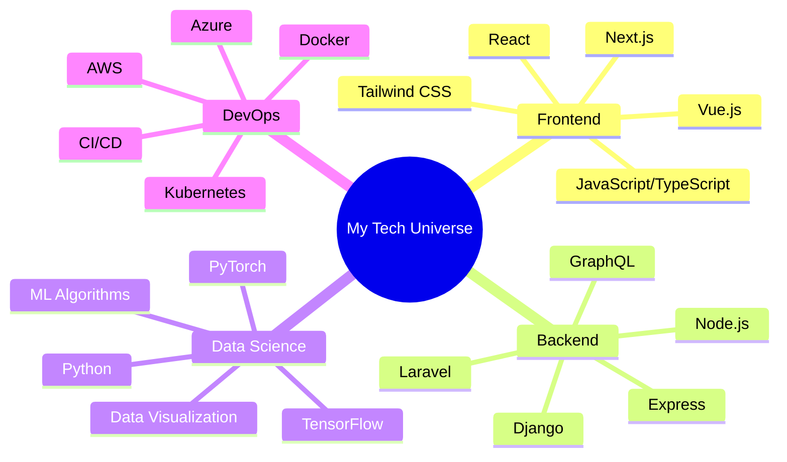

# <div align="center">👨‍💻 Welcome to My Digital Workshop 🚀</div>

<div align="center">
  


</div>

<div align="center">
  <a href="https://yourportfolio.com"></a>
  <a href="mailto:your.email@example.com"></a>
  <a href="https://linkedin.com/in/yourusername"></a>
  <a href="https://twitter.com/yourusername"></a>
</div>

<br/>

## 💡 Interactive Dashboard

<table>
  <tr>
    <td>
      
    </td>
    <td>
      <div align="center">
        
      </div>
    </td>
  </tr>
</table>

<div align="center">
  
</div>

## ⚡ Tech Ecosystem

<div align="center">
  


</div>

## 🌟 Skill Constellations

<div align="center">

| **Category** | **Skills** | **Experience** |
|:------------:|:----------:|:--------------:|
| **Frontend** |   | ⭐⭐⭐⭐⭐ |
| **Backend** |   | ⭐⭐⭐⭐ |
| **Database** |   | ⭐⭐⭐⭐ |
| **AI/ML** |   | ⭐⭐⭐ |
| **DevOps** |   | ⭐⭐⭐ |

</div>

## 🌐 Project Showcase

<div align="center">
  <a href="#project1">
    
  </a>
  <a href="#project2">
    
  </a>
</div>

<div align="center">
  <a href="#project3">
    
  </a>
  <a href="#project4">
    
  </a>
</div>

### Project Details

<details>
<summary id="project1"><b>🤖 AI Image Generator</b></summary>
<br>
  
**Description:** A cutting-edge AI system that generates high-quality images from text prompts, utilizing advanced deep learning techniques and neural networks.

**Tech Stack:** PyTorch, React, FastAPI, AWS

**Features:**
- Text-to-image generation with multiple style options
- Unique innovation in controlling image aesthetics
- High-performance backend with efficient GPU utilization
- User gallery and sharing capabilities

**Demo:** [Live Demo](https://yourdemo1.com)
**Repo:** [GitHub Repository](https://github.com/yourusername/ai-image-generator)
</details>

<details>
<summary id="project2"><b>🛒 E-Commerce Platform</b></summary>
<br>
  
**Description:** A full-featured e-commerce platform with advanced recommendation system and real-time inventory management.

**Tech Stack:** Next.js, Node.js, MongoDB, Redis, Stripe

**Features:**
- Personalized product recommendations
- Real-time inventory and order processing
- Advanced search with filters
- Seamless checkout experience
- Analytics dashboard for business insights

**Demo:** [Live Demo](https://yourdemo2.com)
**Repo:** [GitHub Repository](https://github.com/yourusername/e-commerce-platform)
</details>

<details>
<summary id="project3"><b>📊 Data Visualization Dashboard</b></summary>
<br>
  
**Description:** An interactive dashboard for visualizing complex datasets with real-time updates and customizable display options.

**Tech Stack:** D3.js, React, Express, PostgreSQL

**Features:**
- Real-time data processing and visualization
- Multiple chart types and visualization options
- Data filtering and transformation tools
- Responsive design for all devices
- Export capabilities for reports

**Demo:** [Live Demo](https://yourdemo3.com)
**Repo:** [GitHub Repository](https://github.com/yourusername/data-viz-dashboard)
</details>

<details>
<summary id="project4"><b>🏠 IoT Home System</b></summary>
<br>
  
**Description:** A comprehensive IoT solution for smart home management, with energy optimization algorithms and security features.

**Tech Stack:** Python, MQTT, React Native, TensorFlow

**Features:**
- Centralized control of smart home devices
- Energy usage optimization
- Anomaly detection for security
- Voice command integration
- Mobile app with intuitive UI

**Demo:** [Live Demo](https://yourdemo4.com)
**Repo:** [GitHub Repository](https://github.com/yourusername/iot-home-system)
</details>

## 📈 Coding Activity

<div align="center">
  
  ```
  ⚡ Weekly development breakdown
  -------------------------
  JavaScript   9 hrs 45 mins   ████████████░░░░░░░   56.33%
  Python       4 hrs 12 mins   █████░░░░░░░░░░░░░░   24.31%
  React        2 hrs 30 mins   ███░░░░░░░░░░░░░░░░   14.46%
  CSS          0 hrs 45 mins   █░░░░░░░░░░░░░░░░░░   4.33%
  Other        0 hrs 05 mins   ░░░░░░░░░░░░░░░░░░░   0.57%
  ```
  
</div>

## 🎓 Learning Journey

<div align="center">

</div>

## 📚 Latest Blog Posts

<!-- BLOG-POST-LIST:START -->
- [Building Scalable Architectures for AI Applications](https://yourblog.com/scalable-ai-architectures)
- [The Future of React: What's Coming in 2025](https://yourblog.com/future-of-react-2025)
- [Machine Learning for Beginners: A Practical Guide](https://yourblog.com/ml-for-beginners)
- [Advanced CSS Techniques You Should Know](https://yourblog.com/advanced-css-techniques)
<!-- BLOG-POST-LIST:END -->

## 🏆 Achievements & Certifications

<div align="center">
  <table>
    <tr>
      <td align="center">
        
      </td>
      <td align="center">
        
      </td>
    </tr>
    <tr>
      <td align="center">
        
      </td>
      <td align="center">
        
      </td>
    </tr>
  </table>
</div>

## 🔄 Current Status

<div align="center">
  
```javascript
const currentStatus = {
  learning: ["WebAssembly", "Quantum Computing Basics", "Advanced 3D Visualization"],
  reading: ["Clean Architecture by Robert C. Martin", "Deep Learning by Ian Goodfellow"],
  workingOn: ["Open Source Contributions", "Personal AI Assistant", "Advanced Data Structures Course"],
  challenge: "Building a project using a new technology every month"
};
```

</div>

## 🔮 GitHub Skyline

<div align="center">
  <a href="https://skyline.github.com/yourusername/2024">
    
  </a>
  <br/>
  <i>My GitHub Contributions Skyline for 2024</i>
</div>

## 🤝 Let's Connect

<div align="center">
  <p>I'm always open to interesting conversations, collaboration opportunities, and new projects!</p>
  <a href="https://calendly.com/yourusername/30min">
    
  </a>
</div>

<div align="center">
  
</div>

---

<div align="center">
  <sub>⚡ Built with creativity and code by yours truly ⚡</sub>
</div>